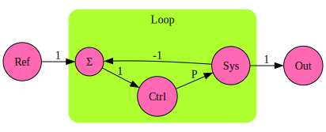

SFG
===

[Signal flow graph](https://en.wikipedia.org/wiki/Signal-flow_graph) calculation and plotting in Python.

Key features:
- Simple definition of the network by calling `add(source_name, destination_name, weight)` for each node in the graph.
- Plotting using the [graphviz](https://pypi.org/project/graphviz/) package, allowing to define groups for better readability.
- Calculating any path gain using [Mason's gain formula](https://en.wikipedia.org/wiki/Mason's_gain_formula).
- Allowing to use [sympy](https://pypi.org/project/sympy/) symbols to calculate the gain as an algebraic expression.

## Requirements

Run `python -m pip install -r requirements.txt` to install the required packages.

Tested with Python 3.12.

## How To Use

### Demo Files

For a simple demo, just run any of the Python files in the `samples` folder.

#### Quick Example

See also `samples/01_minimal.py.py` and `samples/02_control_loop.py`:

    from lib import SFG
    import sympy

    # create SFG
    control_loop = SFG(group_name_separator='.')
    control_loop.add('Ref', 'Loop.Σ')
    control_loop.add('Loop.Σ', 'Loop.Ctrl')
    control_loop.add('Loop.Ctrl', 'Loop.Sys', sympy.symbols('P'))
    control_loop.add('Loop.Sys', 'Out')
    control_loop.add('Loop.Sys', 'Loop.Σ', -1)

    # plot it
    g = control_loop.plot()
    ... # save or display the graph

    # calculate the gain from reference to output
    total_gain = control_loop.calculate_gain('Ref', 'Out')

The resulting graph is:

The resulting gain is `P/(P+1)`.

### Basic Concept

1. Create a SFG object.
2. Add all paths of the system:
    - Each path consists of a source node, a destination node, and a weight (gain).
        - If not specified, the weight is implicitly set to 1.
        - A weight may be a numeric value, or e.g. a `sympy` symbol.
    - A node name may be a string, or a tuple `(group,name)` if you want to group nodes in groups.
        - The groups are only used for plotting, where it might help for visualization of complex graphs.
        - Alternatively, you can specify a separator in the constructor; then every name is split into group and name by the seprator.
        - See demo `samples/02_control_loop.py` for an example.
3. Create a plot of the SFG by calling the `plot()` function.
    - The function will return the graph as a `graphviz.Digraph` object, which you can save or display.
        - See demo `samples/01_minimal.py.py` for an example.
    - You can also plot all loops in the system, by calling the `plot_loops()` function.
        - See demo `samples/02_control_loop.py` for an example.
    - You can also plot all forward paths of a specified path in the system, by calling the `plot_paths()` function, with the names of the source and destination nodes as arguments.
        - See demo `samples/02_control_loop.py` for an example.
4. Calculate the path gain by calling the `calculate_gain()` method.
    - See demo `samples/01_minimal.py.py` for an example.

### Applications

- [Control loops](https://en.wikipedia.org/wiki/Control_loop) (see demo `samples/01_minimal.py.py`)
- [Scattering Parameters](https://en.wikipedia.org/wiki/) (see `samples/03_forced_match.py` )
